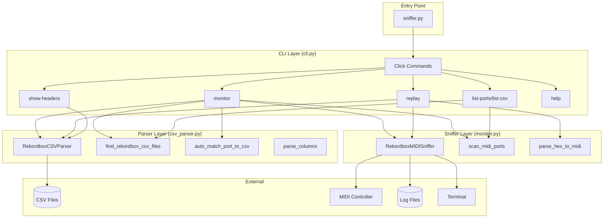
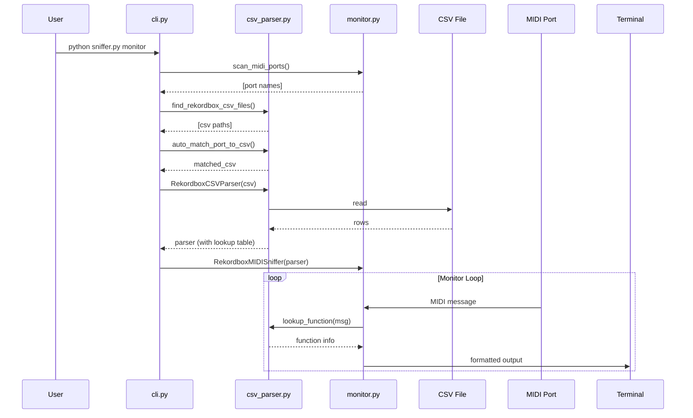

# Rekordbox MIDI Sniffer Architecture

## Overview

The Rekordbox MIDI Sniffer is a CLI tool that monitors MIDI traffic from Pioneer DJ controllers and displays Rekordbox function names by parsing Rekordbox's bundled CSV mapping files.

## Module Structure

```
rb-midi-sniffer/
├── sniffer.py          # Entry point (thin wrapper)
├── csv_parser.py       # CSV parsing and lookup
├── monitor.py          # MIDI monitoring and formatting
├── cli.py              # Click CLI commands
└── docs/
    └── architecture.md # This file
```

## Component Diagram



## Data Flow



## Module Responsibilities

### sniffer.py (Entry Point)
- Thin wrapper that imports and runs the CLI
- Contains module docstring with usage examples

### csv_parser.py (CSV Parsing)
- `RekordboxCSVParser`: Parse Rekordbox CSV files, build MIDI→function lookup table
- `find_rekordbox_csv_files()`: Discover CSV files in standard locations
- `auto_match_port_to_csv()`: Match MIDI port name to CSV file
- `parse_columns()`: Parse user column specifications

### monitor.py (MIDI Handling)
- `RekordboxMIDISniffer`: Monitor MIDI ports, format and display messages
- `scan_midi_ports()`: List available MIDI input/output ports
- `parse_hex_to_midi()`: Convert hex string to mido Message (for replay)

### cli.py (CLI Commands)
- `monitor`: Real-time MIDI monitoring
- `replay`: Replay captured log files
- `list-ports`: Show available MIDI ports
- `list-csv`: Show discovered CSV files
- `show-headers`: Display CSV column headers
- `help`: Show help information

## CSV Lookup Table

The parser builds a lookup table mapping MIDI messages to Rekordbox functions:

```
Key Format: "{msg_type}:{channel}:{data1}"

Examples:
  "note_on:0:11"      → PlayPause (Deck 1)
  "control_change:6:8" → MasterLevel
```

## Dependencies

- **mido**: MIDI I/O library
- **click**: CLI framework
- **pathlib**: File path handling (stdlib)
- **csv**: CSV parsing (stdlib)
